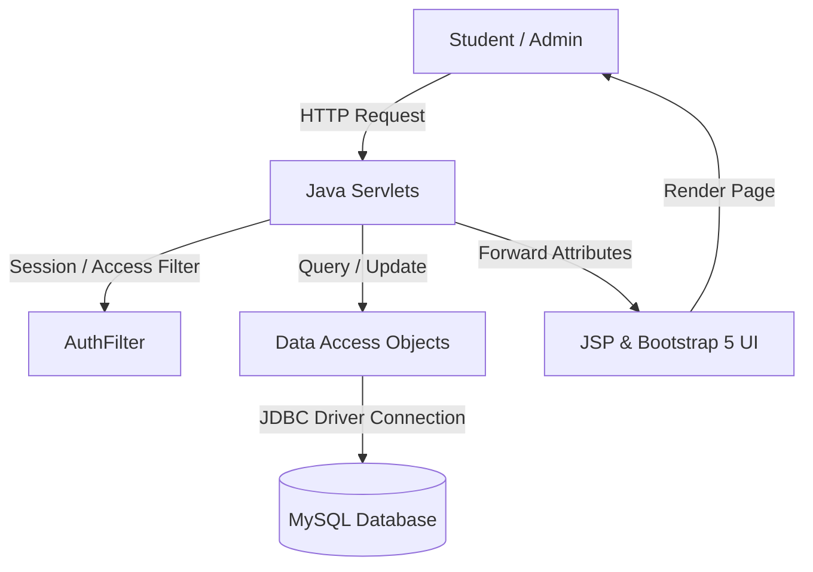
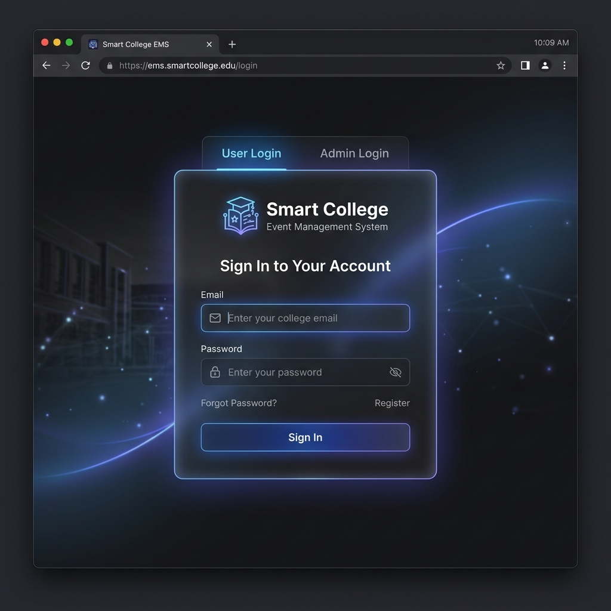
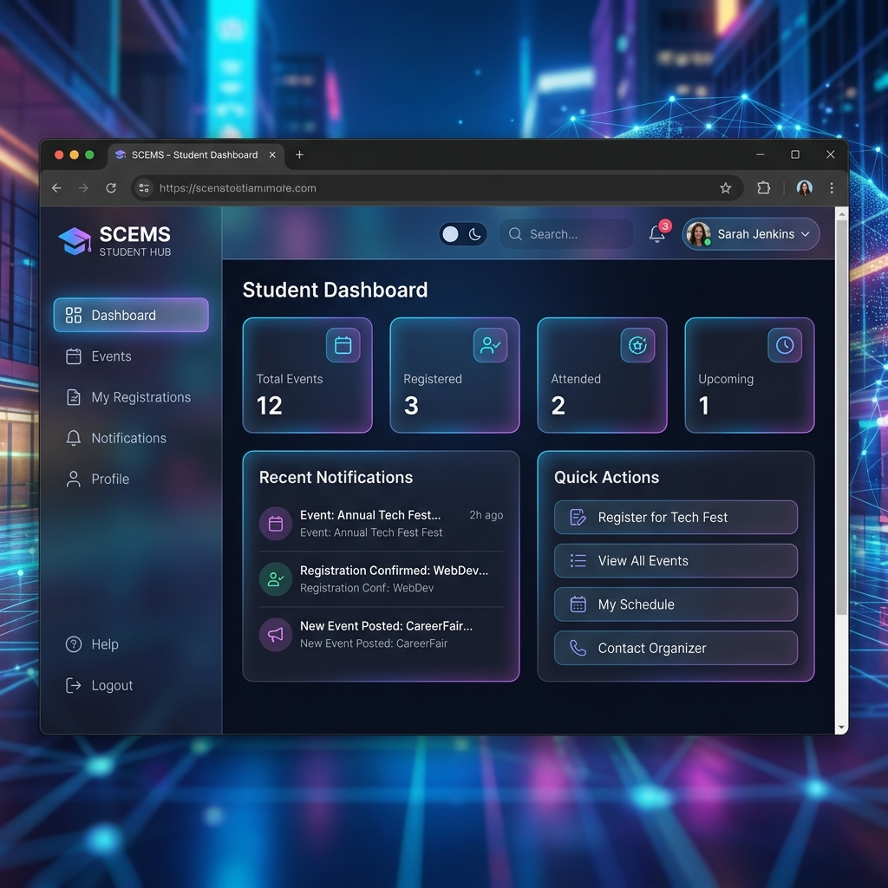
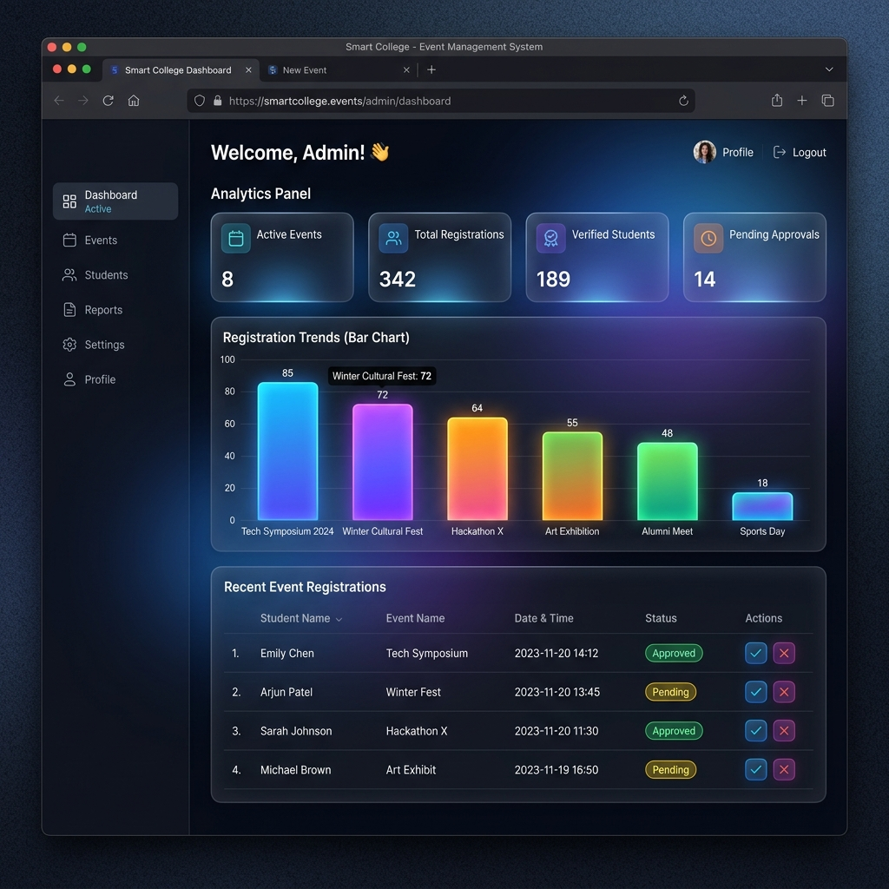
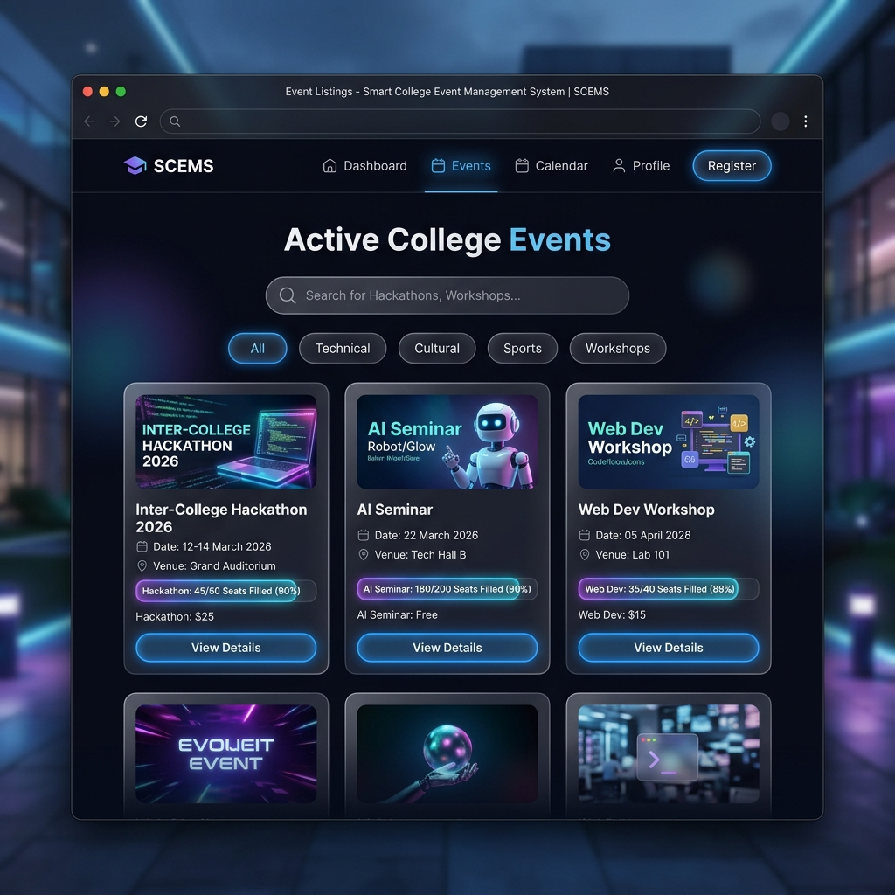
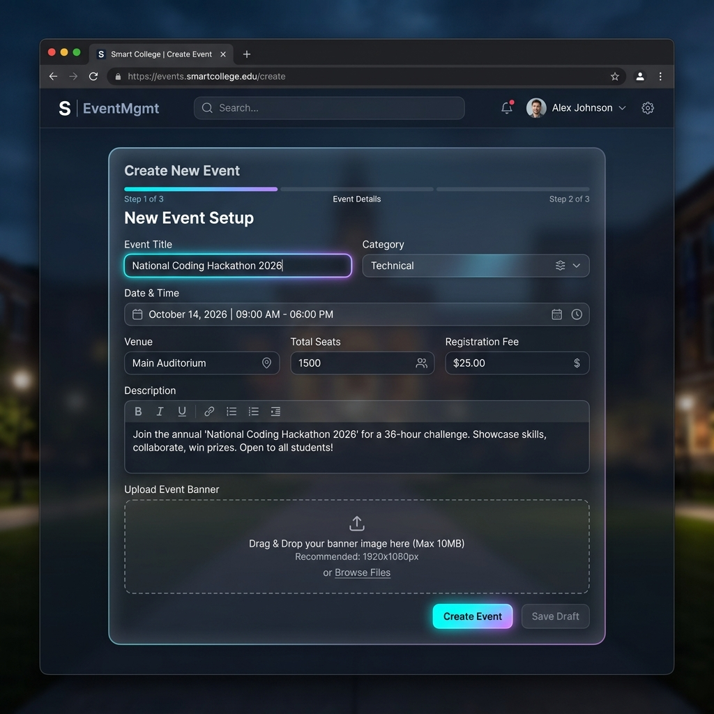
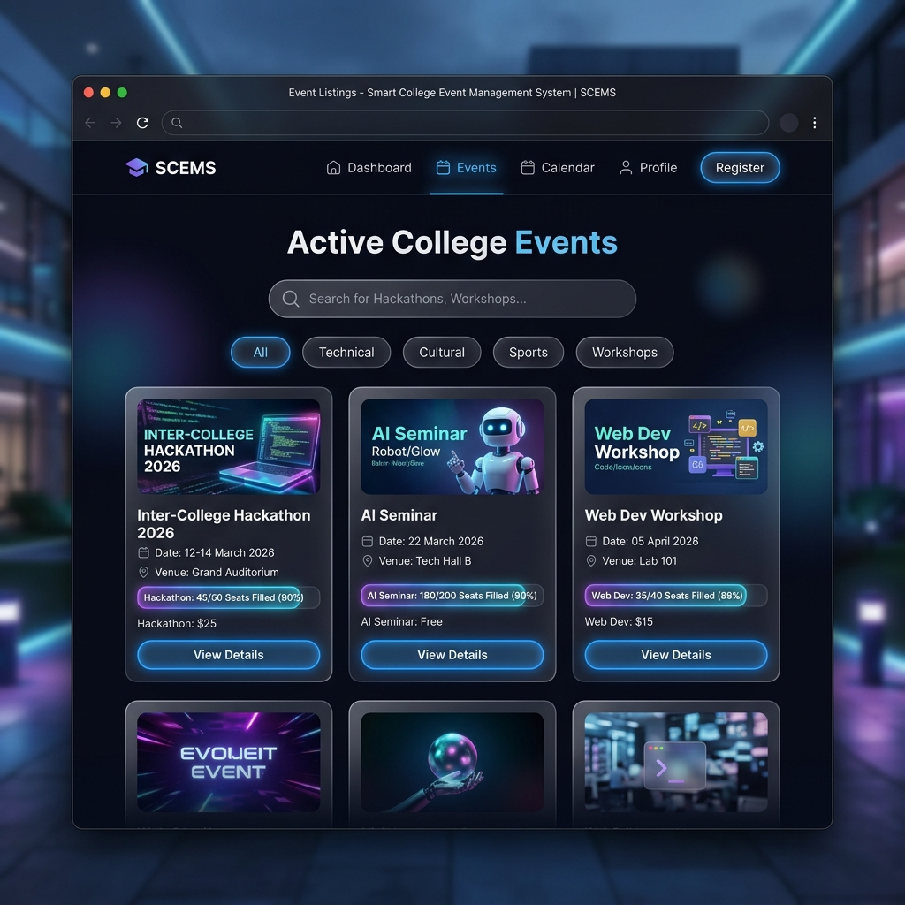
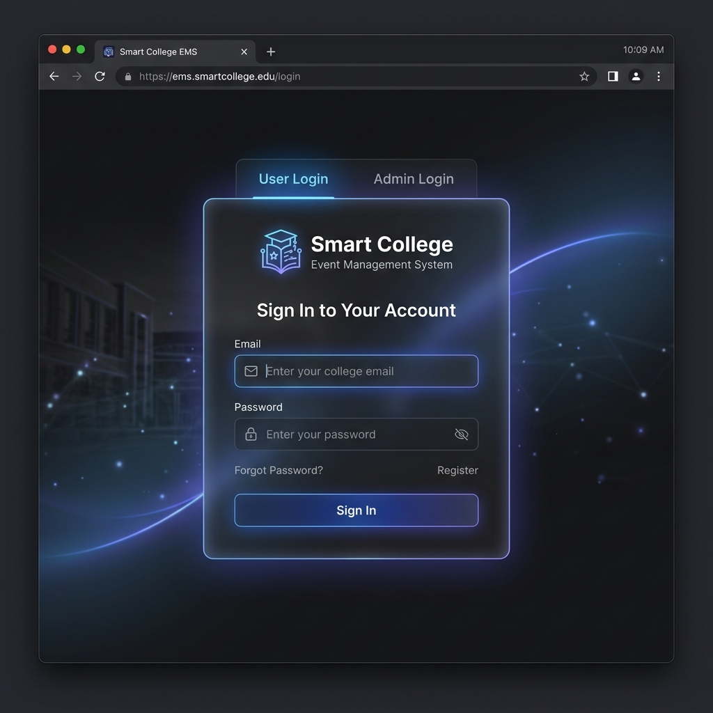

# Smart College Event Management System 🎓

A professional, feature-rich, enterprise-grade college ERP event management web application designed for universities. This platform streamlines campus events, workshops, technical symposiums, sports meets, and cultural fests. It provides roles for Students to browse, search, and register, and Admins to manage and approve event operations.

---

## 🏛️ System Architecture & Workflow

The system is built using a clean implementation of the **Model-View-Controller (MVC)** architectural pattern.



---

## ⚡ Key Features

### Student Portal
* **Clean Tabbed Sign-In**: Simple, professional forms for authentication with OTP fallback.
* **Event Search & Categories**: Interactive search by title and keywords with tab filters (Technical, Cultural, Workshops, Seminars, Hackathons).
* **Seat Limit Counter**: Real-time visualization of remaining seat capacity.
* **Interactive Ticket Receipts**: Printable receipts with dynamic student QR codes.
* **Completion Certificates**: Printable landscape certificates verifying event attendance.
* **Notifications**: Alert box for registration approvals and event reminders.
* **AI Chatbot Helper**: Floating support widget to resolve event queries.

### Admin Portal
* **Dashboard Analytics**: Dynamic stats tracking total events, total registrations, active students, and pending approvals.
* **Event CRUD Panel**: Create, read, update, and delete events with venue, seats, poster, and registration limits.
* **Registration Approvals**: Accept or reject student registrations and mark attendance records.
* **Student Directory**: Complete listing of registered student accounts.

---

## 🛠️ Technologies Used

* **Backend**: Java (JDK 8+), JEE Servlets
* **Frontend**: JSP (JavaServer Pages), JSTL, HTML5, CSS3 (Vanilla Theme), JavaScript (ES6), Bootstrap 5.3
* **Database**: MySQL Server
* **Connection**: JDBC API (Thread-Safe DB Connection Manager)
* **Application Server**: Apache Tomcat 9 / 10
* **Build Tool**: Maven

---

## 📂 Folder Structure

```
smart-college-event-system/
├── pom.xml                        # Maven dependencies
├── schema.sql                     # MySQL database schema & seeding data
├── README.md                      # Setup and deployment manual
├── screenshots/                   # Application screenshots
│   ├── login_page.png
│   ├── student_dashboard.png
│   ├── admin_dashboard.png
│   ├── event_creation.png
│   ├── event_listing.png
│   ├── event_registration.png
│   └── user_profile.png
└── src/
    └── main/
        ├── java/
        │   └── com/
        │       └── collegeevent/
        │           ├── controller/  # MVC Servlets (Auth, Student, Admin, etc.)
        │           ├── dao/         # Database Operations (JDBC queries)
        │           ├── filter/      # Auth Filter (RBAC Guard)
        │           ├── model/       # Data Models (POJOs)
        │           └── util/        # Database Connection Manager
        ├── resources/
        │   └── db.properties        # Database Configurations
        └── webapp/
            ├── WEB-INF/
            │   └── web.xml          # Servlet mappings
            ├── static/              # CSS / JS assets
            └── views/               # JSPs grouped by role (auth, student, admin, common)
```

---

## ⚙️ Installation & Setup Guide

### 1. Database Setup
1. Open your MySQL client (Command Line or Workbench).
2. Create and initialize the database using the SQL script:
   ```sql
   source C:/Users/gayat/.gemini/antigravity/scratch/smart-college-event-system/schema.sql;
   ```
3. Update the credentials in `src/main/resources/db.properties`:
   ```properties
   db.url=jdbc:mysql://localhost:3306/college_event_db
   db.username=root
   db.password=your_mysql_password
   ```

### 2. Packaging the Application
1. Open the project root in your terminal and package the project into a `.war` file:
   ```bash
   mvn clean package
   ```
2. The compiled file `smart-college-event-system.war` will be located inside the `target/` directory.

### 3. Running on Tomcat
1. Copy `target/smart-college-event-system.war` to the `webapps/` folder of your Apache Tomcat installation.
2. Start Tomcat using `bin/startup.bat` (Windows) or `bin/startup.sh` (macOS/Linux).
3. Access the web application at:
   ```url
   http://localhost:8080/smart-college-event-system/
   ```

---

## 🔑 Test Credentials

* **Student Account**: `amit.sharma@student.edu` / `password123`
* **Admin Account**: `admin` / `admin123`

---

## 📸 Application Screenshots

Here are the visual representations of the application UI featuring the redesigned university theme:

### 1. Login Page
The entrance portal featuring separate tabs for students and administrators, a clean university logo area, and a subtle modern background.


### 2. Student Dashboard
A clean workspace displaying active registration statistics, recent notifications, and quick action cards.


### 3. Admin Dashboard
The admin panel with statistical counters, event approval grids, and attendance management controls.


### 4. Event Listing Page
A structured catalog of active college events, symposiums, and cultural programs with remaining seat indicators.


### 5. Event Details Page
A detailed description view showing specific event information, schedules, speakers, and seat details.


### 6. Event Registration Page
The checkout interface displaying registration confirmations and receipt details.


### 7. User Profile Page
The profile management page where students can edit their registered particulars.


---

## 🚀 Future Enhancements

1. **Payment Gateway Integration**: Integration of mockup payment modules for paid event categories.
2. **Auto-Certificate Mailing**: Sending generated PDFs directly to the student's email via SMTP server triggers.
3. **Calendar Integration**: Google Calendar sync option for registered students.
4. **Advanced Analytics**: Deeper charts mapping registration trends over different departments.

---

## 👤 Author Information

* **Developer**: Gayathri
* **GitHub Repository**: [smart-college-event-system](https://github.com/Gayathri302483/smart-college-event-system)
* **Objective**: Academic placement project presentation & professional portfolio demonstration.
